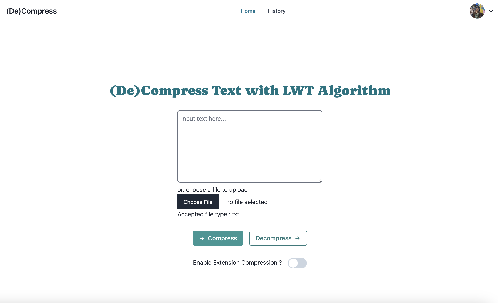
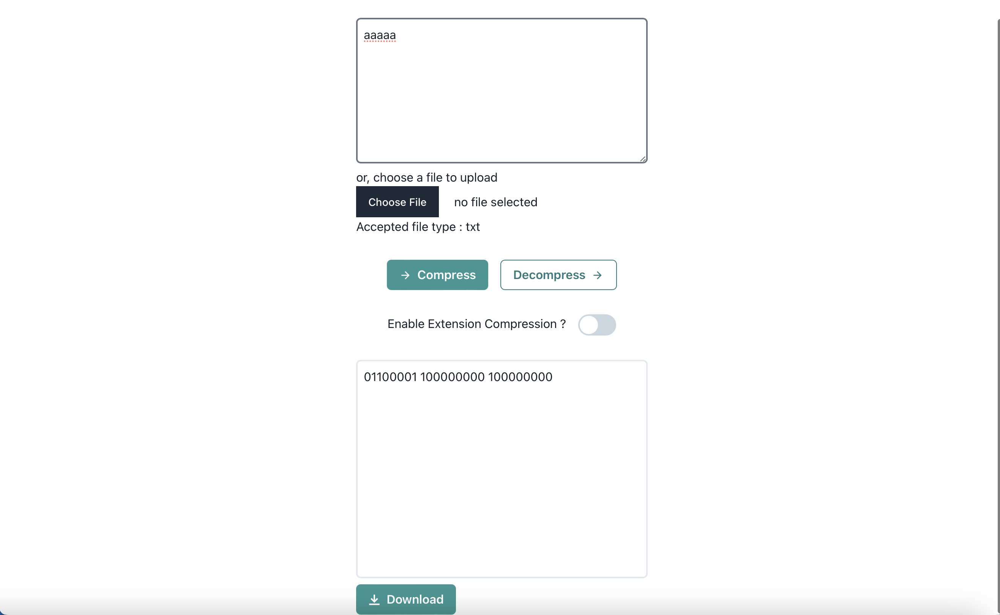
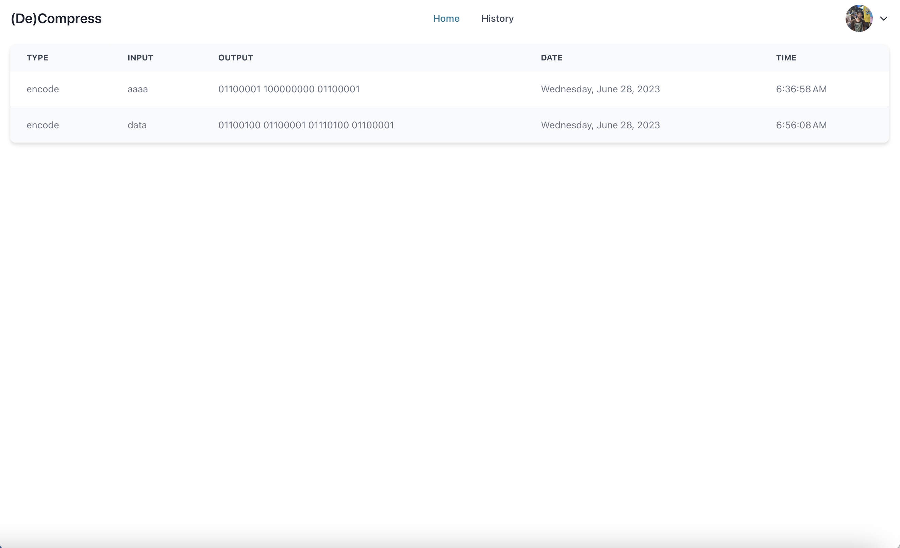

# LZW-Seleksi-IRK
<h2 align="center">
   <a href="" target="_blank">Compression with LZW Algorithm</a>
</h2>
<hr>

## Table of Contents
1. [General Info](#general-information)
2. [Creator Info](#creator-information)
3. [Features](#features)
4. [Technologies Used](#technologies-used)
5. [Setup](#setup)
6. [Usage](#usage)
7. [Proses](#proses)
8. [Screenshots](#screenshots)
9. [Project Status](#project-status)
10. [Room for Improvement](#room-for-improvement)
11. [Acknowledgements](#acknowledgements)
12. [Contact](#contact)
13. [Link](#link)

<a name="general-information"></a>

## General Information
Webapp sederhana yang dapat menerima sekuens string (text layaknya bacaan pada umumnya), mengkompresinya, dan melakukan decode dari sebuah sekuens yang telah dikompresi (decompress).


<a name="creator-information"></a>

## Creator Information

| Nama                        | NIM      | E-Mail                      |
| --------------------------- | -------- | --------------------------- |
| Fajar Maulana Herawan       | 13521080 | 13521080@std.stei.itb.ac.id |

<a name="features"></a>

## Features
- `Melakukan encode` secara manual dengan klik tombol `compress`
- `Melakukan decode` dengan menekan tombol `decompress`
- `Melihat history` dengan menekan tombol `history` pada navbar
- `Mendownload hasil encode/decode` dengan menekan tombol `download`
- `Menambahkan algoritma huffman` dengan menekan toggle `left arrow`

<a name="technologies-used"></a>

## Technologies Used
- Typescript
- React
- NodeJS
- ExpressJS
- MongoDB

> Note: The version of the libraries above is the version that we used in this project. You can use the latest version of the libraries.

<a name="setup"></a>

## Setup
1. Download all of the requirements above by using command:
    ```bash
    npm install
    ```
2. Clone this repository
    ```bash
    https://github.com/fajarmhrwn/LZW-Seleksi-IRK.git
    ```

<a name="usage"></a>

## Usage
1. Buka direktori proyek tempat kamu menyimpan repository ini
2. Ubah lokasi pada folder `BE`
    ```bash
    cd BE
    ```
3. Jalankan server dengan command: 
    ```bash
    node server.js
    ```
4. Ubah lokasi pada folder `FE`
    ```bash
    cd FE
    ```
5. Jalankan web dengan command: 
    ```bash
    npm run dev
    ```
6. Buka browser dan akses `localhost:5173`


<a name="proses"></a>

## Proses
1. Input
    - User memasukkan string yang ingin dikompresi atau didekompresi dapat secara manual ataupun file
    - User menekan tombol `compress` atau `decompress`
    - Web akan mengirimkan request ke server

2. Proses
    - Proses kompresi dan dekompresi dilakukan dengan algoritma LZW
    - Proses kompresi dan dekompresi dilakukan pada server
    - Hasil kompresi dan dekompresi akan dikirimkan ke web

3. Output
    - Output berupa string hasil kompresi atau dekompresi
    - Output dapat diunduh dalam bentuk file
    - Output dapat dilihat pada history


## Screenshots
<p>
  <p>Gambar 1. Tampilan Awal</p>
  
  <nl>
  <p>Gambar 2. Proses Penyelesaian</p>
  
  <nl>
  <p>Gambar 3. Tampilan History</p>
  
  <nl>
</p>

<a name="project-status">

## Project Status
Status dari proyek ini: _complete_

<a name="room-for-improvement">

## Room for Improvement
Peningkatan yang dapat dilakukan:
- Mempercantik UI dari tampilan program
- Menambahkan fitur-fitur lain dalam game

<a name="acknowledgements">

## Acknowledgements
- Terima kasih kepada Allah SWT

<a name="contact"></a>

## Contact
<h4 align="center">
  Kontak : 13521080@std.stei.itb.ac.id<br/>
  2023
</h4>

<a name="link"></a>
## Link
https://lzw-seleksi-irk.vercel.app
<hr>
